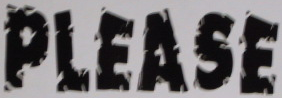

# Text recognition 
Pytorch implementation for image-based sequence recognition tasks, such as scene text recognition and OCR.

# Paper
https://arxiv.org/pdf/1507.05717.pdf

# Demo
| demo images | VGG-BiLSTM-CTC | VGG-BiLSTM-CTC(case-sensitive) |
| ---         |     ---      |          --- |
|      |   available   |  Available |
|    |    professional   |  professional |
|   |   londen   |   Fonden  |
|      |    greenstead    |  Greenstead   |
|    |   weather   |   WEATHER  |
|        |    future    |   Future  |
|    |   research   | Research  |
|  |    grred    | Gredl |

# Performance
| models            | dataset    | samples | accuracy | editing distance |
|-------------------|------------|---------|----------|------------------|
| VGG-BiLSTM-CTC    | ICDAR 2013 | 1015    | 0.7438   | 0.4512           |
|                   | ICDAR 2015 | 2077    | 0.4935   | 1.2335           |
|                   | IIIT5k     | 3000    | 0.746    | 0.5493           |
|                   | SVT        | 647     | 0.6831   | 0.5493           |
|                   | Synth90k   | 891924  | 0.72     | 0.6146           |
| VGG-BiLSTM-CTC    | ICDAR 2013 | 1015    | 0.327    | 2.905            |
| (case-sensitive)  | ICDAR 2015 | 2077    | 0.4265   | 1.6364           |
|                   | IIIT5k     | 3000    | 0.378    | 2.495            |
|                   | SVT        | 647     | 0.4      | 2.3323           |
|                   | Synth90k   | 891924  | 0.696    | 0.7671           |
| ResNet-BiLSTM-CTC | ICDAR 2013 | 1015    |0.3448    |2.8916            |
| (case-sensitive)  | ICDAR 2015 | 2077    |0.4535    |1.546             |
|                   | IIIT5k     | 3000    | 0.39     |2.439             |
|                   | SVT        | 647     | 0.4281   | 2.27             |
|                   | Synth90k   | 891924  | 0.7188   | 0.6859           |

# Usage
* Create lmdb dataset  
Explore ``create_lmdb_dataset.py`` for details
* Training and Evalution  
``python train.py --adadelta --trainRoot {train_path} --valRoot {val_path} --batchSize 64 --cuda``  
``python evaluate.py``
* Demo  
Excute ``python web_demo.py`` to demo with web or ``python raw_demo.py`` to demo with single image

# Training dataset
* Synth90k: 
  * **Introduction:** The Synth90k dataset contains 9 million synthetic text instance images from a set of 90k common English words. Words are rendered onto natural images with random transformations and effects, such as random fonts, colors, blur, and noises. Synth90k dataset can emulate the distribution of scene text images and can be used instead of real-world data to train data-hungry deep learning algorithms. Besides, every image is annotated with a ground-truth word.  
  * **Link:** [Synth90k-download](http://www.robots.ox.ac.uk/~vgg/data/text/)
# Acknowledgements
This implementation has been based on this [repository](https://github.com/meijieru/crnn.pytorch)

# Dependence
* lmdb
* FLask
* torch-summary
* CRAFT
